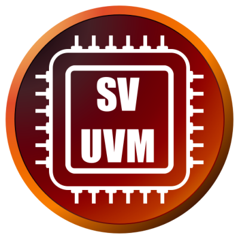
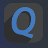

<h1 align="center"> Abdelzaher Mostafa </h1>

## <picture></picture> About Me  

<tr><td>
  <h4>Hey , I'm Abdelzaher Mostafa. I'm interested in Digital Design and Verification ⚡
Senior-1 ECE Student 🎓 at the Faculty of Engineering, Mansoura University 🏛️.</h4>

 
- 💻 Former Trainee at the NTI Summer Internship on **"Digital Design Using FPGA"**
- 💻 Completed a **Digital Design and Verification Diploma with** *Eng. Kareem Waseem*.
- 🌱 I’m **Digital Design and Digital Verification** Enthusiast
- 👥 I’m looking to collaborate on **Digital IC Design and Verification projects**

- 📌 My Certificates: [**My Certificates**](https://drive.google.com/drive/folders/1wLnmo-zaktLcIwCR7eIdSk7qb3D9_7EX)

- 📄 My CV: [**CV**](https://drive.google.com/file/d/1iTrZAlm4sX4-ybmtKeU5pVz4rnus5max/view?usp=drivesdk)

- 📧 Reach me at: **abdelzahermostafamashal@Gmail.com**

---

## 🌐 Connect with me:

  
  
    

---

##  <b>Skills</b>

### 🧠 Languages:

  
    
  
  
  
  
  

### 🛠 Tools & Platforms:

  
  
  
  
  
  
  
  <code></code>
  <code></code>

---

## 📊 GitHub Stats  

  
  

---

## 🏆 Achievements  
- 🏳️ **Vice head & Instructor of Digital IC design at Breakin point**  February 2025 - Present  
- 🏳️ **PR member at Breakin point** for November 2024 - Present
- 🏳️ **HR member at Starks** for November 2024 - March 2025

---

### 💻 OS:

  

---

<table align="center">
  <tr>
    <td align="center">
      <h3>👀 View Count</h3>
      

        
      

    </td>
  </tr>
</table>

